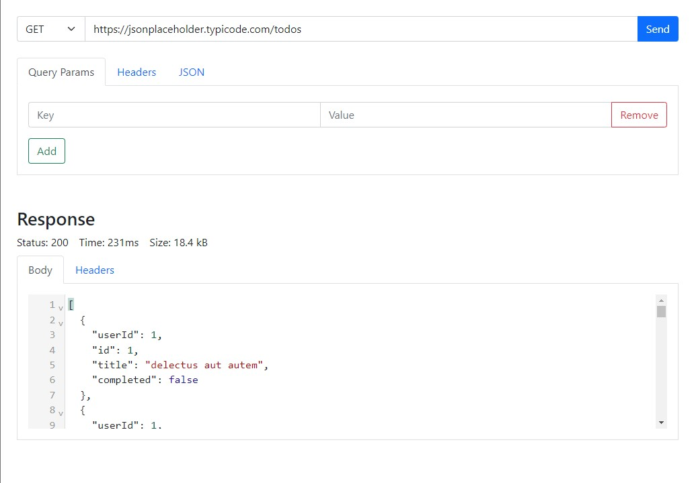

# APIng
This is a tool to make calls to a REST API to perform CRUD actions. (Postman Clone)

## Getting Started

**This project was created using Node v17.2.0**

1. Start by cloning or forking this repo.
2. From the directory run `npm install`.
3. To start the application run `npm run start`. This will auto launch a browser window with the application loaded.

